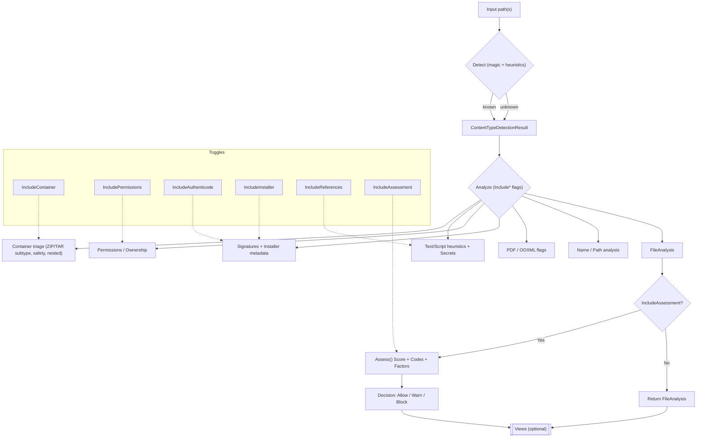
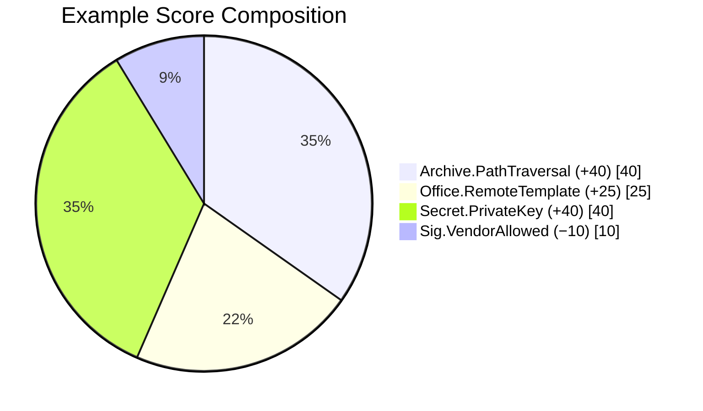
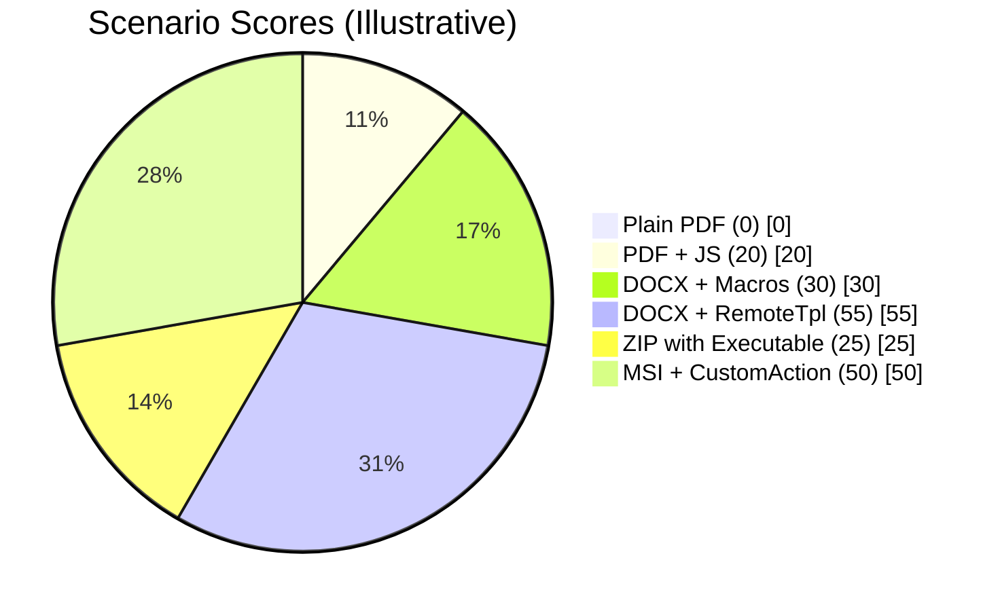

<!-- Badges -->

# FileInspectorX — Content Type Detection and Analysis for .NET and PowerShell

📦 NuGet (Library)

[](https://www.nuget.org/packages/FileInspectorX)
[](https://www.nuget.org/packages/FileInspectorX)

💻 PowerShell Module

[](https://www.powershellgallery.com/packages/FileInspectorX.PowerShell)
[](https://www.powershellgallery.com/packages/FileInspectorX.PowerShell)
[](https://www.powershellgallery.com/packages/FileInspectorX.PowerShell)
[](https://www.powershellgallery.com/packages/FileInspectorX.PowerShell)

🛠️ Project Information

[](https://github.com/EvotecIT/FileInspectorX)
[](https://github.com/EvotecIT/FileInspectorX)

👨‍💻 Author & Social

[](https://twitter.com/PrzemyslawKlys)
[](https://evotec.xyz/hub)
[](https://www.linkedin.com/in/pklys)
[](https://www.threads.net/@przemyslaw.klys)
[](https://evo.yt/discord)

## What it's all about

FileInspectorX is a library for content type detection (magic bytes + heuristics) and lightweight analysis (containers, PDFs, PE triage, text/script cues) across .NET 8, .NET Standard 2.0 and .NET Framework 4.7.2. A thin PowerShell module provides pipeline‑friendly cmdlets with reusable typed views.

## Install

### NuGet (Library)

```bash
dotnet add package FileInspectorX
```

### PowerShell (Module)

```powershell
Install-Module FileInspectorX.PowerShell
# or local build
Import-Module .\FileInspectorX.PowerShell\bin\Debug\net8.0\FileInspectorX.PowerShell.dll
```

## C# Quick Start

```csharp
using FileInspectorX;

var options = new FileInspector.DetectionOptions { ComputeSha256 = true, MagicHeaderBytes = 16 };
var analysis = FileInspector.Analyze(path, options);

Console.WriteLine($"{analysis.Detection?.Extension} {analysis.Detection?.MimeType} {analysis.Kind} {analysis.Flags}");

// Flatten for tabular/log display
var summary = SummaryView.From(path, analysis);
var perms   = PermissionsView.From(path, analysis.Security);
var sig     = SignatureView.From(path, analysis.Authenticode);

// Detection only
var detOnly = FileInspector.Detect(path, options);
```

## C# Recipes

```csharp
// Presentation-ready report + map
var analysis = FileInspector.Analyze(path);
var report = ReportView.From(analysis);
var map = report.ToDictionary();

// Humanize flags if you only have CSV
string flagsShort;
if (!map.TryGetValue("AnalysisFlagsHuman", out var human))
{
    map.TryGetValue("AnalysisFlags", out var csv);
    flagsShort = Legend.HumanizeFlagsCsv(csv?.ToString());
}
else flagsShort = human?.ToString() ?? string.Empty;

// Render a Markdown report (dependency-free)
var md = MarkdownRenderer.From(analysis);

// Include file system metadata + flattened dictionary
var summary2 = FileInspector.InspectWithMetadata(path, new FileInspector.DetectionOptions { MagicHeaderBytes = 64 });
var metadata = summary2.Metadata;

// Optional: top tokens for scripts/logs (disabled by default)
Settings.TopTokensEnabled = true;
Settings.TopTokensMax = 8;
Settings.TopTokensMinLength = 4;
Settings.TopTokensMinCount = 2;

// Compare declared vs detected (with alternatives)
var cmp = FileInspector.CompareDeclaredDetailed(".log", summary2.Analysis.Detection);
Console.WriteLine($"Mismatch? {cmp.Mismatch} Reason={cmp.Reason}");

// Consume typed legends directly
foreach (var entry in Legend.GetAnalysisFlagLegend())
    Console.WriteLine($"{entry.Short} = {entry.Long}");
```

## PowerShell Examples

```powershell
# Raw is default (full object)
Get-FileInsight -Path .\file.bin | Format-List

# Opt-in compact views
Get-FileInsight -Path .\file.bin -View Summary | Format-Table -Auto

# Other views: Summary | Detection | Permissions | Signature | Analysis | ShellProperties
Get-FileInsight -Path .\file.bin -View Detection | Format-Table -Auto
Get-FileInsight -Path .\file.bin -View Permissions | Format-Table Path,Owner,Group,ModeSymbolic,EveryoneWriteAllowed -Auto
Get-FileInsight -Path .\app.exe -View Signature | Format-List
Get-FileInsight -Path .\package.msix -View Installer | Format-Table -Auto
Get-FileInsight -Path .\song.mp3 -View ShellProperties | Format-Table -Auto

# Exclude sections to trim work/shape
Get-FileInsight -Path .\file.bin -ExcludePermissions -ExcludeReferences -ExcludeShellProperties | Format-List

# Back-compat: detection only
Get-FileInsight -Path .\file.bin -DetectOnly | Format-List
```

### PowerShell quick help

```powershell
# Discover parameters and examples
Get-Help Get-FileInsight -Detailed
Get-Help Get-FileInsight -Examples

# Detect-only for all EXE files under the current directory
Get-ChildItem -Filter *.exe -File -Recurse | Get-FileInsight -View Detection | Format-Table -Auto

# Summarize a directory, skipping signature and installer enrichment
Get-ChildItem -File -Recurse | Get-FileInsight -View Summary -ExcludeSignature -ExcludeInstaller | Format-Table -Auto
```

## Views

- SummaryView: Path, Kind, Extension, MimeType, Confidence, Reason, Flags
- DetectionView: Path, Extension, MimeType, Confidence, Reason, ReasonDetails, BytesInspected, Sha256Hex, MagicHeaderHex
- AnalysisView: container/text/script/PE/Auth summaries
- PermissionsView (Windows & Unix): Owner/Group (+ IDs), ModeOctal/ModeSymbolic, IsExecutable, Everyone/Users/Admins read/write, HasDenyEntries
- SignatureView: Present, EnvelopeSignatureValid, ChainValid, Timestamp, signer info, FileHashMatches, SubjectCN/Org, IssuerCN/Org, IsSelfSigned
- InstallerView: Name/Publisher/Version/Manufacturer/ProductCode for MSI; Identity/Publisher/Display for MSIX/APPX; Publisher for VSIX
- ReferencesView: (generic) FilePath/Url/Command values found in configs (Task XML, scripts.ini), with Exists and Issues flags
- AssessmentView: compact risk score (0–100), decision (Allow/Warn/Block/Defer), and finding codes
  - Codes include: Package.VendorPresent/VendorUnknown/VendorAllowed, Sig.VendorAllowed/Sig.VendorUnknown, Archive.* and Pdf.* flags, etc.
- ShellPropertiesView (Windows only): Windows shell properties (Explorer Details), e.g., Title/Authors/BPM/Initial Key, etc.
  - IncludeEmpty enumerates the full Details property list and can be slower.

## Usage Model: Raw + Views + Exclude Toggles

- Default Raw
  - The cmdlet returns the full `FileAnalysis` object by default (`-View Raw`). This is a single, rich object with Detection, Flags, Security, Authenticode/Installer, References, Assessment, Secrets summary, and more.

- Views for display
- Use `-View Summary|Detection|Analysis|Permissions|Signature|References|Assessment|Installer|ShellProperties` to get compact, tabular shapes.
  - Every view carries `.Raw` so you can drill back into the full object without re‑invoking.

- Trim work/shape with excludes
  - `-ExcludePermissions`, `-ExcludeSignature`, `-ExcludeInstaller`, `-ExcludeReferences`, `-ExcludeContainer`, `-ExcludeAssessment`, `-ExcludeShellProperties`.
  - In C#, use `new FileInspector.DetectionOptions { IncludePermissions = false, ... }`.

```csharp
var lean = FileInspector.Analyze(path, new FileInspector.DetectionOptions {
    IncludePermissions = false,
    IncludeReferences = false,
    IncludeShellProperties = false,
    IncludeAuthenticode = true,
    IncludeAssessment = true
});
```

## API Choices: Detect vs Inspect vs Analyze

Pick the API based on how much work you want the library to do and how much metadata you need:

- Detect(path[, options]) → ContentTypeDetectionResult
  - Fast header-only magic/heuristics (null if unknown)
  - Minimal I/O, ideal for bulk triage or hot loops
  - options can still capture Sha256Hex and MagicHeaderHex

- Inspect(path[, options]) → FileAnalysis (single entry point)
  - If options.DetectOnly = true → returns a minimal FileAnalysis wrapping Detect
  - Otherwise → performs full analysis (same as Analyze)

- Analyze(path[, options]) → FileAnalysis
  - Full analysis: container/PDF/PE/Auth/permissions/script cues/CSV estimates
  - Returns everything Detect provides plus extra flags and metadata

Examples (C#)

```csharp
// Detection only (fast)
var det = FileInspector.Detect(path, new FileInspector.DetectionOptions { MagicHeaderBytes = 16 });

// Single entry point (detect-only)
var detFa = FileInspector.Inspect(path, new FileInspector.DetectionOptions { DetectOnly = true });

// Full analysis
var full = FileInspector.Inspect(path, new FileInspector.DetectionOptions { ComputeSha256 = true });
var summary = full.ToSummaryView(path);
```

## Detection Ordering & Declared Extension Bias

Detection runs in a stable order so downstream callers can reason about outcomes:

- Magic-byte signatures and fast format checks run first (archives, executables, media, databases, etc.).
- Container refinements (ZIP subtypes, OLE2 subtypes) run next when applicable.
- Text/markup heuristics (JSON/XML/YAML/INI/CSV/PS/Batch/etc.) run after binary checks.
- Plain-text fallback is last when the content looks printable.

Declared extension is used as a bias only for ambiguous/low-confidence cases:

- `Detect(path)` uses the file extension as the declared value automatically.
- `Detect(stream, options, declaredExtension)` and `Detect(ReadOnlySpan<byte>, options, declaredExtension)` let you supply the declared extension to match path-based behavior.
- Bias is applied only for ambiguous text families (e.g., cmd vs bat, admx/adml vs xml, inf vs ini, ini vs toml) and low-confidence generic text (log/txt/md/ps1/psm1/psd1). Strong magic-byte matches are not overridden.
- `CompareDeclared` normalizes leading dots and can fall back to `GuessedExtension` when `Extension` is empty (e.g., ZIP subtypes).
- `CompareDeclaredDetailed` returns the mismatch plus reasoning and detection alternatives (when available).

## Features

- Fast detection: magic bytes + heuristics (images, archives, PDFs, executables, text/markup, scripts, CSV/TSV, DMG/ISO/UDF, EVTX, ESE, RIFF/media, etc.)
- Humanized output: friendly type labels (e.g., “Word document”, “ZIP archive”) and legend‑based flag descriptions via ReportView
- Analysis helpers
  - ZIP/TAR summaries (EntryCount, TopExtensions, nested archive hints)
  - Optional deep container scan (bounded): disguised types, known tool indicators, inner signers summary (see below)
  - PDF flags (JavaScript, OpenAction, AA, Names tree, EmbeddedFiles, ManyEmbeddedFiles)
  - PE triage (machine/subsystem, UPX hint)
  - Text family & CSV/TSV line estimates; generic log/schema cues (IIS W3C, Event XML, Sysmon, LDIF, AAD, MDE)
- Script safety cues (neutral): ps:encoded, ps:iex, py:exec-b64, lua:exec, rb:eval (no raw high‑signal strings)
- Secrets (privacy‑safe counts only): PrivateKey/JWT/KeyPattern
- Permissions snapshot: cross‑platform owner/group + Unix modes; Windows ACL summaries (Everyone/Users/Admins read/write, deny ACEs); MOTW/ADS on Windows
- Signatures: Authenticode summary and optional Windows policy (WinVerifyTrust) + timestamp/EKUs
- Crypto file detection:
  - ASCII‑armored PGP blocks (message/public key/signature)
  - Binary OpenPGP packet header (generic, low‑confidence)
  - DER X.509 certificate (heuristic ASN.1 OID scan)
  - PKCS#12/PFX (ASN.1 OID scan)
- Office & PDF flags:
  - OOXML (Word): Remote template (OfficeRemoteTemplate), possible DDE (OfficePossibleDde)
  - OOXML (Excel): External links (OfficeExternalLinks) and count (OfficeExternalLinksCount)
  - PDF: XFA (PdfHasXfa), Encrypted (PdfEncrypted), ManyIncrementalUpdates (PdfManyIncrementalUpdates)
- Citrix cues: ICA files and Receiver/Workspace configuration (XML)
- AOT‑friendly: safe for NativeAOT
- Name/path checks: BiDi controls, double extension, extension mismatch, suspicious whitespace
- Archive safety: traversal/absolute paths/symlinks flags from ZIP sampling

## References & Recipes


The library can extract generic references from common configuration files so consumers can validate what will execute or be accessed. This is domain‑agnostic and useful for many scenarios (build pipelines, endpoint hygiene, or pre‑upload checks).

- Extracted kinds: FilePath, Url, Command, EnvVar, RegistryPath, Clsid.
- Current extractors:
  - Windows Task Scheduler Task XML: captures `<Exec><Command>`, `<Arguments>`, `<WorkingDirectory>` and `<ClassId>` (COM handler). Flags unquoted paths, UNC usage, relative paths.
  - GPO scripts INI (scripts.ini / psscripts.ini): captures `nCmd` and `nParameters` values, extracts paths and URLs.

PowerShell

```powershell
# List references from a Task XML
Get-FileInsight -Path .\Task.xml -View References | Format-Table -Auto

# List references in a GPO scripts.ini
Get-FileInsight -Path .\scripts.ini -View References | Format-Table -Auto
```

C#

```csharp
var a = FileInspector.Analyze(path);
foreach (var r in a.References ?? Array.Empty<Reference>())
{
    Console.WriteLine($"{r.Kind} {r.Value} exists={r.Exists} issues={r.Issues}");
}
```

C# (Assessment)

```csharp
var full = FileInspector.Analyze(path);
var assess = FileInspector.Assess(full);
Console.WriteLine($"Score={assess.Score} Decision={assess.Decision} Codes={string.Join(" ", assess.Codes)}");

// Factors show score contributions per code (explainability)
foreach (var kv in assess.Factors)
{
    Console.WriteLine($"{kv.Key} => {kv.Value}");
}
```

PowerShell (Assessment)

```powershell
Get-FileInsight -Path .\file.bin -View Assessment | Format-Table -Auto
```

This stays generic by design. A higher‑level component (e.g., TierBridge) can layer policy (allow/warn/block) using these references and the existing Flags/SecurityFindings.

## Inner Signers Inside Archives (deep scan)

When `Settings.DeepContainerScanEnabled = true`, FileInspectorX can sample a bounded number of inner executables in ZIP archives to provide a quick signer summary without fully extracting archives. The following fields are exposed on `FileAnalysis` and surfaced via `ReportView`:

- `InnerExecutablesSampled`: how many inner EXE/DLLs were sampled (bounded by `DeepContainerMaxEntries` and `DeepContainerMaxEntryBytes`).
- `InnerSignedExecutables`: how many of those were Authenticode‑signed.
- `InnerValidSignedExecutables`: how many had a valid chain or passed WinVerifyTrust (when available).
- `InnerPublisherCounts`: top publishers (SignerSubjectCN) with counts.

Notes:
- This is a best‑effort, privacy‑safe summary for triage. It extracts only sampled entries to a temporary file for analysis and deletes them immediately.
- Currently implemented for ZIP. TAR/7z/RAR can be added similarly if needed.

```csharp
var a = FileInspector.Analyze(path);
if (a.InnerExecutablesSampled > 0)
{
    Console.WriteLine($"Inner execs: {a.InnerExecutablesSampled}, signed: {a.InnerSignedExecutables}, valid: {a.InnerValidSignedExecutables}");
    if (a.InnerPublisherCounts != null)
        foreach (var kv in a.InnerPublisherCounts.OrderByDescending(kv => kv.Value).Take(5))
            Console.WriteLine($"  {kv.Key}: {kv.Value}");
}
```

## Friendly Type Labels & ReportView

Use `ReportView.From(FileAnalysis)` for presentation‑ready fields:

- `DetectedTypeFriendly`: a human‑friendly label (e.g., “Word document”, “ZIP archive”, “X.509 certificate”).
- `FlagsHumanShort/Long`: legend‑based humanization of flags and heuristics.
- `AssessmentCodesHuman`: humanized assessment codes.

These are exported via `ReportView.ToDictionary()` for templating/email systems.
Example keys: `DetectedTypeExtension`, `DetectedTypeName`, `DetectionConfidence`, `CompanyName`, `ProductName`, `FileVersion`, `AnalysisFlags`, `AnalysisFlagsHuman`, `AssessmentScore`, `AssessmentDecision`, `AssessmentCodes`, `EncryptedEntryCount`, `InnerFindings`, `TopTokens`.

## Thread Safety Notes

- Settings are static/global; configure once at startup.
- Avoid concurrent mutation while detection is running; if you need runtime updates, protect changes with your own lock.
- `DetectionScoreAdjustments` defaults to `ConcurrentDictionary`. If you replace it with a non-thread-safe dictionary, you are responsible for synchronization.

## Settings Cheatsheet

```csharp
// Deep container scanning (bounded)
Settings.DeepContainerScanEnabled = true;      // default: false
Settings.DeepContainerMaxEntries = 64;         // sample cap
Settings.DeepContainerMaxEntryBytes = 262144;  // per‑entry cap (256 KB)
Settings.KnownToolNameIndicators = new[] { "pingcastle", "bloodhound" };
Settings.KnownToolHashes = new Dictionary<string,string> { /* name => lowercase sha256 */ };

// Script & secrets scanning
Settings.SecurityScanScripts = true;           // default: true
Settings.SecretsScanEnabled = true;            // default: true

// Authenticode (Windows policy optional)
Settings.VerifyAuthenticodeWithWinTrust = true;   // default true on Windows
Settings.VerifyAuthenticodeRevocation = false;    // default

// Vendor allow hints (for assessment)
Settings.AllowedVendors = new[] { "Microsoft", "YourCompany" };
Settings.VendorMatchMode = VendorMatchMode.Contains; // or Exact
```

## Flags → Assessment Codes (Quick Map)


- Archive safety
  - ArchiveHasPathTraversal → Archive.PathTraversal (+40)
  - ArchiveHasAbsolutePaths → Archive.AbsolutePath (+15)
  - ArchiveHasSymlinks → Archive.Symlink (+20)
  - ContainerContainsExecutables → Archive.ContainsExecutables (+25)
  - ContainerContainsScripts → Archive.ContainsScripts (+20)
  - ContainerContainsArchives → Archive.ContainsArchives (+15)

- Office / OOXML
  - HasOoxmlMacros → Office.Macros (+30)
  - OfficeRemoteTemplate → Office.RemoteTemplate (+25)
  - OfficePossibleDde → Office.PossibleDde (+15)
  - OfficeExternalLinks → Office.ExternalLinks (+5) [count exposed as OfficeExternalLinksCount]

- PDF
  - PdfHasJavaScript → Pdf.JavaScript (+20)
  - PdfHasOpenAction → Pdf.OpenAction (+15)
  - PdfHasLaunch → Pdf.Launch (+20)
  - PdfHasNamesTree → Pdf.NamesTree (+10)
  - PdfHasXfa → Pdf.Xfa (+10)
  - PdfEncrypted → Pdf.Encrypted (+10)
  - PdfManyIncrementalUpdates → Pdf.ManyUpdates (+5)

- PE hardening
  - PeLooksPackedUpx → PE.PackerSuspect (+20)
  - PeNoAslr → PE.NoASLR (+15)
  - PeNoNx → PE.NoNX (+20)
  - PeNoCfg → PE.NoCFG (+15)
  - PeNoHighEntropyVa (x64) → PE.NoHighEntropyVA (+5)

- Signatures
  - Self‑signed → Sig.SelfSigned (+20)
  - Chain invalid → Sig.ChainInvalid (+25)
  - Bad envelope → Sig.BadEnvelope (+15)
  - Vendor allowed (allowed list) → Sig.VendorAllowed (−10)

- Vendor / Package
  - Vendor present → Package.VendorPresent (0)
  - Vendor allowed (allowed list) → Package.VendorAllowed (−15)
  - Vendor unknown → Package.VendorUnknown (0)
  - MSI CustomActions (EXE/Script/DLL) → Msi.CustomActionExe (+20) / Msi.CustomActionScript (+20) / Msi.CustomActionDll (+10)

- Scripts & secrets (neutral categories)
  - Script.Encoded (+25), Script.IEX (+20), Script.WebDownload (+15), Script.Reflection (+10)
  - Secret.PrivateKey (+40), Secret.JWT (+25), Secret.KeyPattern (+15)

## Assessment Pipeline (Flowchart)



## Scoring Breakdown (Example)



Notes
- Factors in Assessment.Factors report the exact weights (negative values reduce Score).
- Actual weights are configurable in code and may evolve; see README map above for typical values.

## Sample Scenario Scores (Illustrative)

GitHub's Mermaid version may not support the new `chart` directive yet, so here's a pie fallback and a simple table.



```
Scenario                  Score
------------------------  -----
Plain PDF                 0
PDF + JS                  20
DOCX + Macros             30
DOCX + Remote Template    55
ZIP with Executable       25
MSI with Custom Action    50
```

These values are illustrative only — actual scores depend on which signals are present and the configured weights.

## Settings

- HeaderReadBytes (default 4096)
- DetectionReadBudgetBytes (default 1 MB)
- SecurityScanScripts (default true)
- VerifyAuthenticodeWithWinTrust (default true on Windows)
- VerifyAuthenticodeRevocation (default false)
- JS minified heuristics: JsMinifiedMinLength, JsMinifiedAvgLineThreshold, JsMinifiedDensityThreshold
- Assessment thresholds: AssessmentWarnThreshold, AssessmentBlockThreshold
- Vendor allow‑list: AllowedVendors (string[]), VendorMatchMode (Contains|Exact)
 - Secrets: SecretsScanEnabled (default true)

## Secrets Summary (privacy‑safe)

The full object (Raw/FileAnalysis) exposes <code>Secrets</code> with category counts only — no values are stored:

```powershell
$fa = Get-FileInsight -Path .\script.ps1
$fa.Secrets | Format-List
```

```csharp
var fa = FileInspector.Analyze(path);
var s = fa.Secrets;
Console.WriteLine($"privKeys={s?.PrivateKeyCount} jwt={s?.JwtLikeCount} keyPat={s?.KeyPatternCount}");
```

## Signatures (Authenticode)

- Cross‑platform
  - Parses Authenticode PKCS#7 and extracts the content digest (SpcIndirectDataContent)
  - Recomputes PE image digest excluding checksum and WIN_CERTIFICATE table
  - Sets AuthenticodeInfo.FileHashMatches and FileDigestAlgorithm
- Windows (optional)
  - WinVerifyTrust policy verification (catalog-aware) → IsTrustedWindowsPolicy + WinTrustStatusCode

## Permissions & Ownership

- Unix: mode bits via .NET (UnixFileMode); owner/group names via `stat` where available
- Windows: Owner/Group friendly names (NTAccount), ACL summaries
  - EveryoneReadAllowed/EveryoneWriteAllowed
  - BuiltinUsersReadAllowed/BuiltinUsersWriteAllowed
  - AdministratorsReadAllowed/AdministratorsWriteAllowed
  - HasDenyEntries

## Platforms & AOT

- .NET 8, .NET Standard 2.0, .NET Framework 4.7.2
- NativeAOT friendly; WinVerifyTrust runs only on Windows

## Build

- Library: `dotnet build FileInspectorX/FileInspectorX.csproj`
- Tests: `dotnet test`
- PowerShell module: `dotnet build FileInspectorX.PowerShell` (then Import-Module the built DLL)

## Notes

- Script “security findings” are neutral codes — reduces AV triggers
- Owner/group on Unix via `stat` when available (fields may be null; mode bits still populate)
